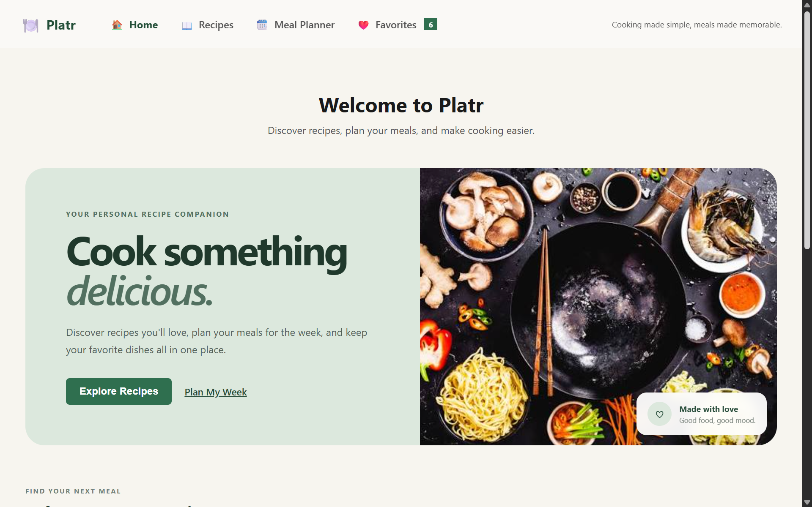
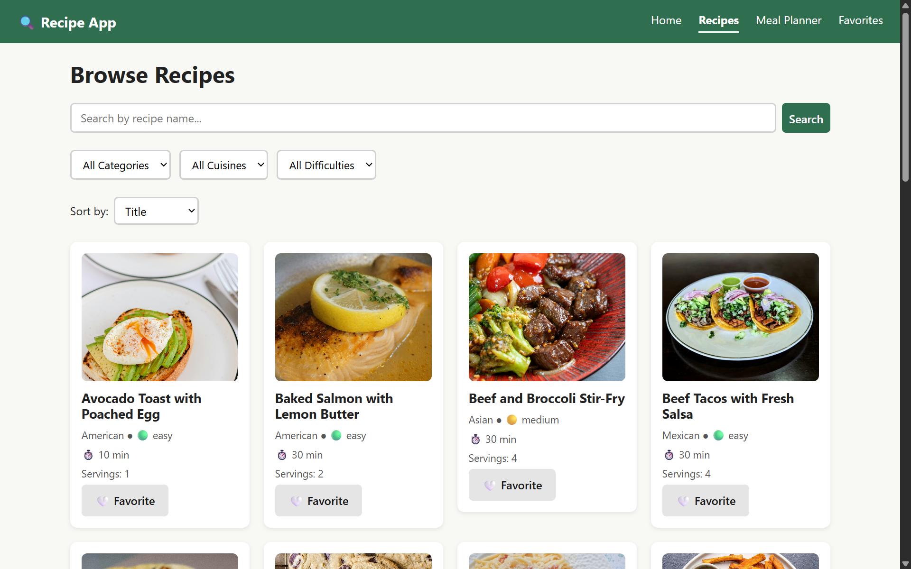
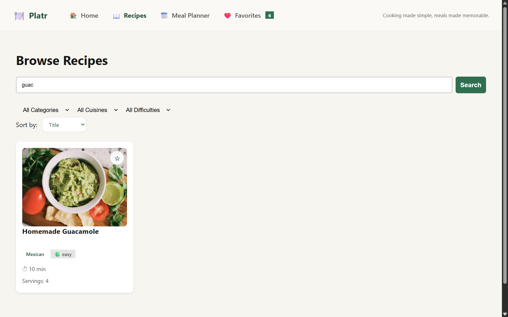
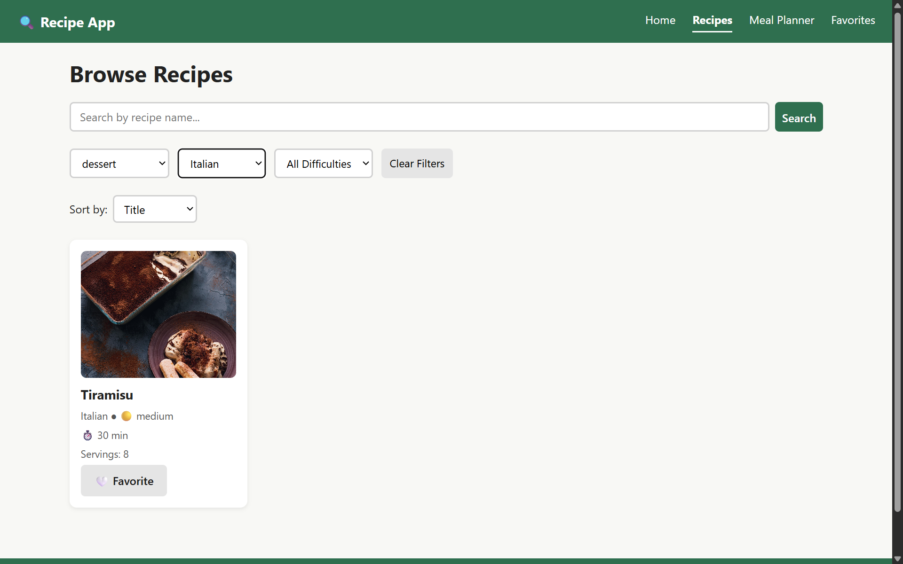
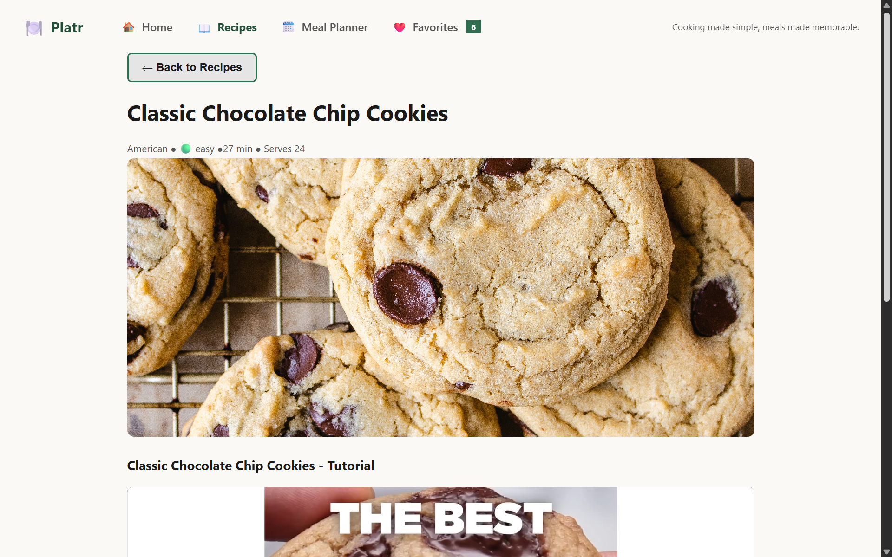
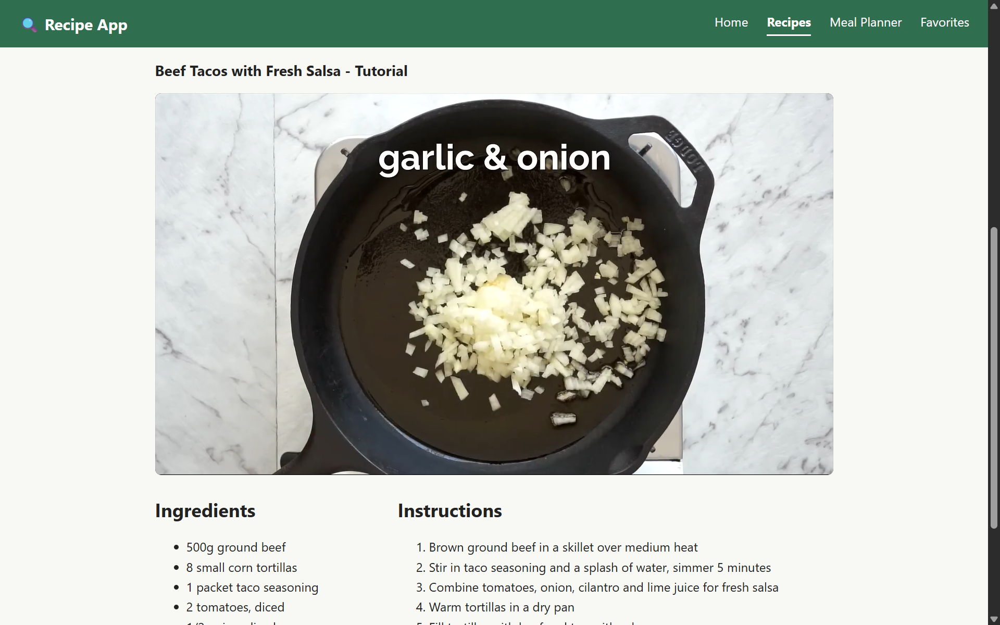
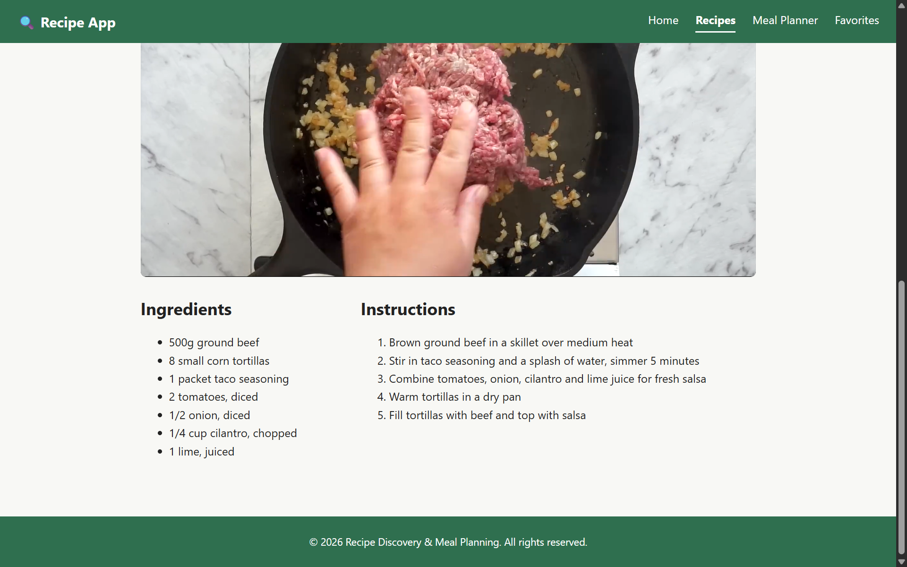
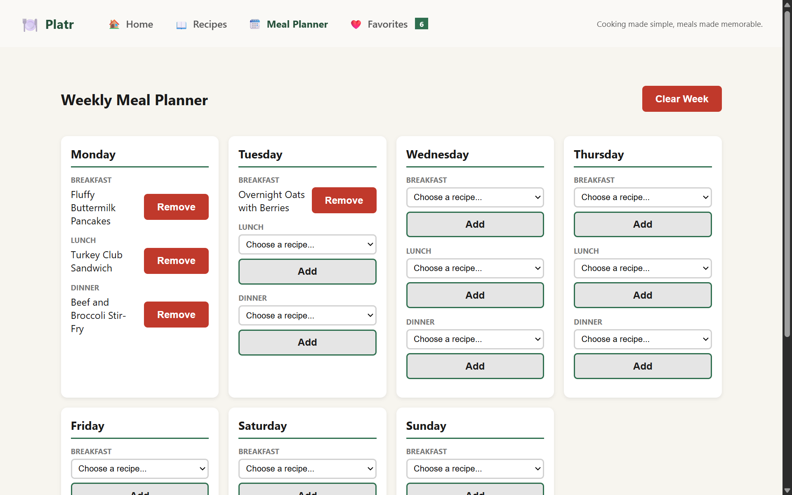
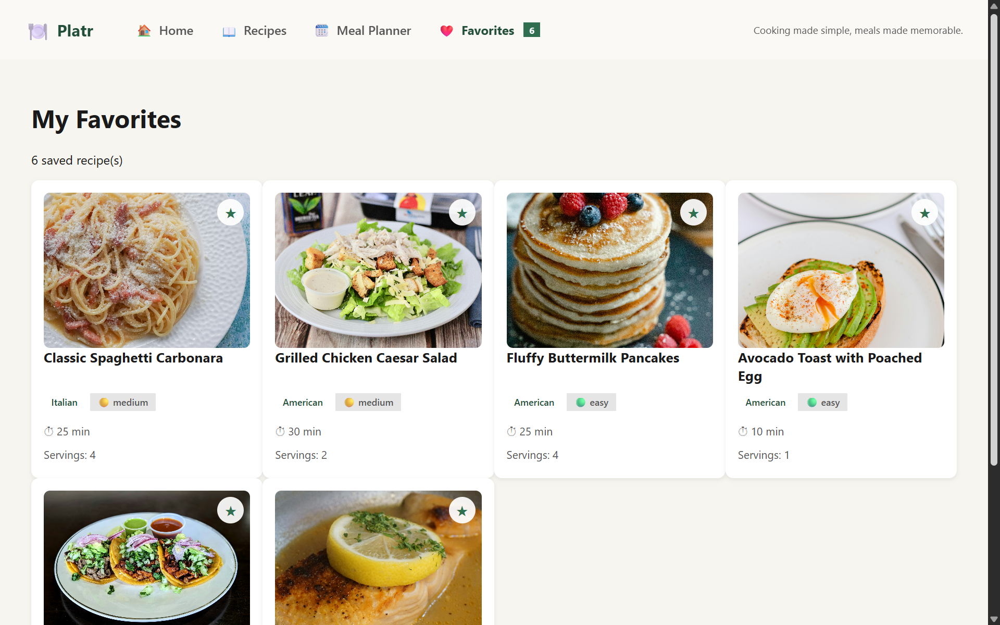
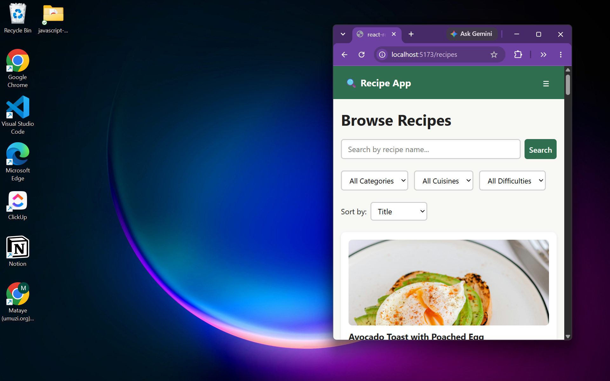

# Recipe Discovery & Meal Planning

## Project Overview

Recipe Discovery & Meal Planning is a responsive React web application that helps users discover recipes, search and filter meals, create a weekly meal plan, watch cooking tutorials, listen to cooking tips, and save their favourite recipes.

The application was developed as a React capstone project to demonstrate component-based architecture, props, state management, event handling, React Router, reusable components, local storage, and responsive styling.

## Features

* Browse a collection of 17 recipes.
* Search recipes by name.
* Filter recipes by category, cuisine, and difficulty.
* Sort recipes by title, cooking time, or difficulty.
* View detailed recipe information, including ingredients and instructions.
* Watch recipe-specific cooking tutorials using HTML5 video.
* Listen to cooking tips using HTML5 audio.
* Add and remove recipes from favourites.
* Store favourites in localStorage so they remain available after refreshing.
* Create a Monday–Sunday weekly meal plan.
* Assign breakfast, lunch, and dinner recipes to each day.
* Save the meal plan using localStorage.
* Clear the entire weekly meal plan.
* Responsive navigation with a mobile menu.
* Custom 404 page for invalid routes.

## Technologies Used

* React
* JavaScript (ES6+)
* React Router
* Vite
* CSS Modules
* HTML5 Video and Audio
* Browser localStorage
* Git and GitHub

## Architecture

The application follows a component-based React architecture. Pages are responsible for larger sections of the application, while reusable components handle common functionality such as navigation, buttons, cards, recipe lists, filters, media players, loading states, and meal-planning controls.

State that needs to be shared between different parts of the application is managed in `App.jsx` and passed to child components through props. Local component state is used where functionality only belongs to an individual component.

## Project Structure

```text
src/
├── assets/
├── components/
│   ├── Navigation/
│   ├── Recipe/
│   ├── MealPlanner/
│   ├── Media/
│   ├── UI/
│   └── common/
├── data/
├── pages/
├── utils/
├── App.css
├── App.jsx
├── index.css
├── index.js
└── main.jsx

public/
└── assets/
    ├── audio/
    ├── images/
    └── videos/
```

## Main Components

* **Navbar** – Provides navigation links, active route styling, a responsive mobile menu, and the favourites count.
* **RecipeCard** – Displays a recipe summary and allows users to favourite a recipe.
* **RecipeList** – Renders multiple recipe cards.
* **RecipeFilter** – Provides category, cuisine, and difficulty filters.
* **RecipeDetail** – Displays complete recipe information and its cooking tutorial.
* **MealPlanner** – Displays the weekly meal-planning interface.
* **DayCard** – Handles meal selection for an individual day.
* **VideoPlayer** – Provides HTML5 video playback with fallback text.
* **AudioPlayer** – Provides HTML5 audio playback with fallback text.
* **Button, Card, Loading, Modal** – Reusable UI components.

## State Management

React `useState` is used for interactive state such as search terms, filters, favourites, meal selections, and the mobile navigation menu.

`useEffect` is used for loading recipe data and synchronising favourites and the meal plan with `localStorage`.

Favourites and the weekly meal plan are stored in `localStorage`, allowing user selections to persist after a page refresh.

## Routing

React Router is used to provide multiple pages:

* `/` – Home
* `/recipes` – Recipe browsing
* `/recipes/:id` – Individual recipe details
* `/meal-planner` – Weekly meal planner
* `/favorites` – Favourite recipes
* `*` – 404 Not Found page

The application also uses active navigation links, URL parameters, and programmatic navigation.

## Installation

Install the project dependencies:

```bash
npm install
```

Start the development server:

```bash
npm start
```

Alternatively, the Vite development command can be used:

```bash
npm run dev
```

The application will then be available through the local Vite development URL.

To create a production build:

```bash
npm run build
```

## Future Enhancements

Future improvements could include user accounts, recipe creation, more advanced dietary and ingredient filters, drag-and-drop meal planning, shopping-list generation, and integration with an external recipe API.

## Screenshots

### Home



### Recipes



### Recipe Search



### Recipe Filters



### Recipe Details







### Meal Planner



### Favorites



### Mobile Layout



````